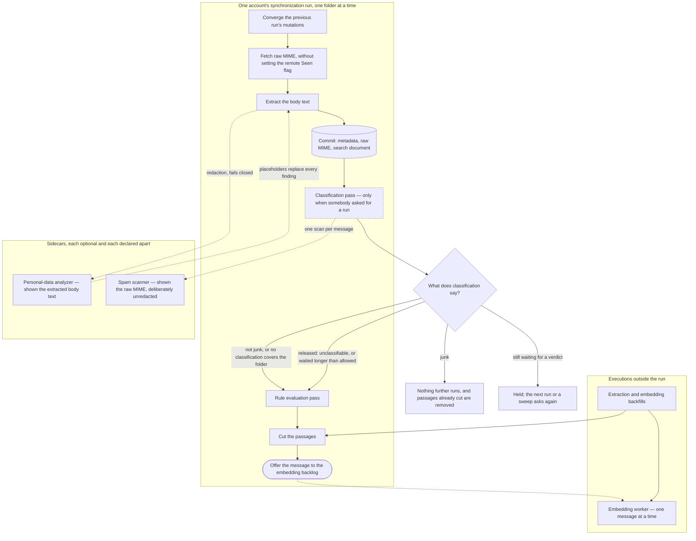

# The arrival pipeline

<!-- describes: src/Application/Synchronization/MailboxSynchronizer.cs, src/Application/Emails/Chunking/MailChunkingPass.cs, src/Infrastructure/Persistence/Emails/StoredEmailChunkingStore.cs, src/Application/Emails/Extraction/RedactingEmailMimeReader.cs, src/Application/Spam/Gating/**, src/Application/Spam/Runs/SpamClassificationPass.cs, src/Application/Rules/Evaluation/MailRuleEvaluationPass.cs, src/Host/Hosting/Workers/AccountSynchronizationSupervisor.cs, src/Host/Hosting/Workers/MailEmbeddingWorker.cs -->

Six features decide what happens to a message between the moment synchronization commits it and the moment everything
derived from it exists. Each of them documents its own half, and none of them can state the order, because the order is
what they have between them. This page is that order, drawn once.

It is a graph rather than a list. A message branches at its classification verdict, two of the stages are calls into
sidecars, and one of them — redaction — is a guard on the way into a derived store rather than a stage every message
walks through. The reason to draw it is that prose describing a graph is reconstructed wrongly, and the wrong
reconstruction has one shape: a new derived step placed on the wrong side of a gate.

## The order

The dashed border on the classification pass is the one stage that is a seam rather than a running job in this release:
the call site sits where the order requires it, and what reaches it today is an operator asking for a run over a
mailbox. Nothing classifies a message because it arrived. The trigger that will is
[issue 730](https://github.com/Krzysztof318/MailFathom/issues/730), and until it ships the gate below releases mail that
has waited longer than a verdict is allowed to take, so an unclassified deployment indexes exactly as it did before
classification existed.

## What the run waits for, and what it hands off

Everything inside the account run is sequential and the run waits for all of it. The one hand-off is the last arrow:
offering a message to the embedding backlog is a non-blocking enqueue into a bounded in-process queue, and **a full
backlog is not an error**. An initial synchronization of a large mailbox produces work faster than any provider accepts
it, so the bound refuses rather than waits; the message is stored with its passages, and the
[embedding backfill](../features/embedding-backfill.md) is what reaches mail the live path did not.

Nothing else about the pipeline crosses a process boundary while a transaction is open. The two sidecar calls happen
outside the commit that follows them, and the embedding provider is reached only by the worker, which consumes committed
state.

## The two sidecars, and why one of them sees unredacted mail

Both are optional, both are declared apart from each other, and a deployment that configures neither runs the whole
pipeline unchanged.

| Sidecar | What it is shown | What its silence does |
| --- | --- | --- |
| Personal-data analyzer | The extracted body text of one message | **Fails closed.** The derivation is refused, nothing derived is written, and the run retries the message later |
| Spam scanner | The raw MIME of one message | **Fails open.** No verdict is recorded, the message keeps waiting, and the wait's own bound eventually releases it |

The asymmetry is deliberate and it is the single most important thing on this page. Redaction is an egress guard: text
that reached a derived store unscanned is text a retrieval hit can hand back months later, and putting it back costs a
re-derivation from raw MIME. Classification is an opinion about a message: a scanner that cannot answer must not be able
to stop a mailbox from being indexed, which is why every path releases mail that has waited too long.

The spam scanner is shown the message as it arrived, placeholders and all absent, because a classifier scoring redacted
text would be scoring a different message from the one the sender wrote —
[spam classification](../features/spam-classification.md) records that decision. Redaction covers the body and only the
body; a subject, an address, and a thread identifier are routing metadata, and what protects those on the way out is the
[egress guard](../features/sensitive-content-scanning.md) rather than the derived store.

## What each classification outcome permits

The gate reads where the message is now and what was decided about it, and it writes nothing down — which is what makes
mail an owner drags out of the junk folder ordinary mail from that moment.

| Outcome | Rules | Passages | Vectors |
| --- | --- | --- | --- |
| Junk — a verdict, or the message is in the account's junk folder | No | No, and any already cut are removed | No |
| Not junk, or the folder is outside the configured scope | Yes | Yes | Yes |
| Still waiting for a verdict | No, held | No, held | No, held |
| Released — the message carries nothing classifiable, or it waited longer than allowed | Yes | Yes | Yes |

A held message is held rather than dropped. The same four facts are read again by the next account run and by both
sweeps, so a verdict that arrives late, a wait that runs out, and a message moved out of the junk folder all admit it
without any stored state having to say it was once withheld. What the outcome does reach is a counter: the run records
the gate's answer as each message arrives, because work that never starts leaves no other trace and a mailbox held
behind classification would otherwise read exactly like a mailbox with no mail in it.

## Why the cut is not part of the commit

The transaction that stores a message contains its metadata, its raw MIME, and its search document — and deliberately
not its passages. Two stages run after that commit and before the cut, and both can change what the cut should produce:
classification can decide the message is not derived from at all, and the owner's rules can file it into a folder mapped
differently from the one it arrived in. Passages are not undone by a message moving afterwards, so cutting inside the
commit would write passages of a placement and a verdict that had not been settled yet.

The rules are the slower of the two, because a rule declares a move rather than performing one: the record is durable
when the pass ends and the account's **next** run carries it to the mail server. So waiting for the pass is not enough
on its own, and the cut passes over a message whose relocation is still converging — cutting it once the message is in
the folder it ended up in, under that folder's mapping. A relocation that completed or was abandoned holds nothing
back, since neither will move the message again.

What the ordering costs is one extra local transaction per message and nothing else: the cut reads the search document
the commit already wrote, so it reaches no mail server, no provider, and no sidecar. What it removes is a whole class of
defect that is invisible when it happens.

## The paths that re-derive the same data

Three paths produce derived data, and all three obey the order above rather than a version of it. Two of them wait for
a stamp only an account run writes — the record that the rule pass has finished with a message — so on a deployment with
`MailSynchronization:Enabled` set to `false` neither cuts a *first* set of passages: no run starts, nothing is stamped,
and mail stored without them gains none until synchronization is switched on again. What the stamp holds back is that
first cut alone, so a rebuild is not covered by it: the extraction backfill runs whether or not synchronization does,
and with `SensitiveContent:RebuildStaleDerivedData` switched on it replaces the passages a message already carries —
and, through them, the vectors the replacement cascades away.

- **The live path** is the run drawn here.
- **The extraction backfill** re-reads raw MIME stored before extraction existed. It redacts through the same guard,
  writes the same search document, and cuts through the same writer, so a message it reaches arrives at the state a
  newly synchronized one reaches rather than at a state a second walk has to finish. It cuts only what both stages in
  front of the cut have finished with, which is what keeps *the same state* true: the text it has just written is
  exactly what lets the rule pass read a message it had been skipping, and cutting in this transaction would cut before
  that pass ever saw it. Such a message is cut by the account's next run instead. Both stages are waited for a *first*
  cut alone, so a message that already carries passages is re-cut whatever they say: this walk is the only path that
  can replace a passage, and withholding one here would leave the passages — and the vectors built from them — derived
  under exactly the configuration a rebuild exists to replace, beside stored text reporting the new one.
- **The embedding backfill** sweeps for messages with extracted text and no passages, and for passages with no vector.
  It cuts through the same writer and is narrowed by the same classification predicate, the same rule stamp, and the
  same folder switch, so it reaches whatever one account run's batch budget did not. The rule stamp is what stops it
  being a way around the order: it runs on its own interval while a run is still fetching a mailbox, so a first
  synchronization would otherwise have its mail cut here before the rules had read any of it. A held message needs no
  sweep to be released either: the account's own next run asks the gate again and cuts it in the same run the verdict
  admits it.

## What the two folder switches decide

`GenerateEmbeddings` and `VisibleToTools` are set per folder mapping;
[what a mapping decides beyond where the folder is](../features/imap-synchronization.md#what-a-mapping-decides-beyond-where-the-folder-is)
states both. What they decide about this pipeline is the cut:

| `GenerateEmbeddings` | `VisibleToTools` | Passages |
| --- | --- | --- |
| `true` | `true` | Cut |
| `true` | `false` | **Cut** — a folder withheld from tools is still embedded, from the same redacted text |
| `false` | `true` | Not cut; the folder is still mirrored, listed, read, and searched lexically |
| `false` | `false` | Not cut |

Extraction runs for every mirrored folder whatever the switches say, because the extracted text is what a lexical search
matches on and what a read hands back. Redaction therefore runs for every mirrored folder too, on every deployment that
has a scanner switched on.

## Where each stage is documented

| Stage | Page |
| --- | --- |
| Fetching and committing a message | [IMAP synchronization](../features/imap-synchronization.md) |
| Classification, its verdicts, and the gate | [Spam classification](../features/spam-classification.md) |
| The owner's rules and what a match asks for | [Mail rules](../features/mail-rules.md) |
| Redaction, the stamp, and the egress guard | [Sensitive-content scanning](../features/sensitive-content-scanning.md) |
| The boundary rules a cut obeys | [Message chunks](../features/message-chunks.md) |
| Offering, embedding, and what a ceiling does | [Automatic embedding](../features/automatic-embedding.md) |
| Reaching mail the live path missed | [Embedding backfill](../features/embedding-backfill.md) |
