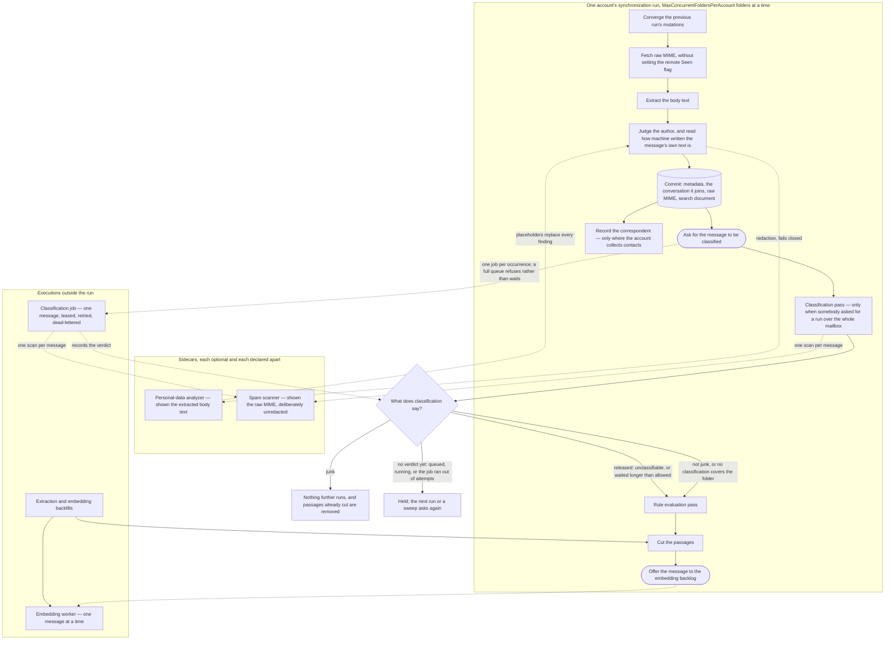

# The arrival pipeline

<!-- describes: backend/src/Application/Synchronization/MailboxSynchronizer.cs, backend/src/Application/Emails/Chunking/MailChunkingPass.cs, backend/src/Infrastructure/Persistence/Emails/StoredEmailChunkingStore.cs, backend/src/Application/Emails/Extraction/RedactingEmailMimeReader.cs, backend/src/Application/Emails/Extraction/SenderTrustEvaluatingEmailMimeReader.cs, backend/src/Application/Emails/Extraction/MachineAuthorshipEvaluatingEmailMimeReader.cs, backend/src/Application/Emails/Threads/EmailThreadAssembly.cs, backend/src/Application/Spam/Gating/**, backend/src/Application/Spam/Runs/SpamClassificationPass.cs, backend/src/Application/Spam/SpamClassificationArrivals.cs, backend/src/Application/Contacts/Collection/MailContactCollector.cs, backend/src/Application/Spam/EmailSpamClassificationHandler.cs, backend/src/Application/Rules/Evaluation/MailRuleEvaluationPass.cs, backend/src/Host/Hosting/Workers/AccountSynchronizationSupervisor.cs, backend/src/Host/Hosting/Workers/MailEmbeddingWorker.cs -->

Eight features decide what happens to a message between the moment synchronization fetches it and the moment
everything derived from it exists. Each of them documents its own half, and none of them can state the order, because
the order is what they have between them. This page is that order, drawn once.

It is a graph rather than a list. A message branches at its classification verdict, two of the stages are calls into
sidecars, and one of them — redaction — is a guard on the way into a derived store rather than a stage every message
walks through. The reason to draw it is that prose describing a graph is reconstructed wrongly, and the wrong
reconstruction has one shape: a new derived step placed on the wrong side of a gate.

## The order

**Two judgements sit between the parse and the commit.** Whether the author extraction established is one the
account recognizes, and how much the message's own text reads as machine written, are decisions this deployment makes
rather than facts read out of the message's bytes — so each is a decorator over the reader that parses raw MIME rather
than a step inside it, which is what puts them on every path that produces a reading rather than only on this one. Both
run *before* redaction, deliberately: redaction replaces the words a scanner recognized, and a reading taken afterwards
would judge a message partly by what the scanner rewrote in it. Neither carries any of the text out — what each writes
is a verdict, a set of signals, a number, and the revision of the policy or profile it was reached under, none of which
can hold a fragment of the message — so taking them ahead of the guard costs the guard nothing.

Classification happens in two places and the drawing separates them deliberately. **A message is classified because it
arrived**: the run asks for one as soon as it has committed the message and its content, and the work runs as an
execution of the durable queue — leased to one worker, retried per message with a jittered backoff, and dead-lettered
when it cannot succeed. That per-message backoff is the whole reason it is a job rather than another pass of the run: a
scan reaches a sidecar that can be unreachable, saturated, or restarting, and a run whose only recovery is deferring the
whole account cannot express one message out of three hundred deserving another attempt.

The pass inside the run is the second place, and it is the operator's:
[classifying the mail you already have](../features/spam-classification.md#classifying-the-mail-you-already-have) walks
a mailbox that was stored before any of this, or stored while the feature was off. Both reach the same use case, record
the same record, and consult the same sidecar; what differs is which mail they cover.

Four things can become of one classification, and the gate below reads what was recorded rather than what happened to
the job. A verdict of junk withholds the message; a verdict of anything else admits it; a scan that could not answer
still records the verdict the headers reached, so the message is admitted or withheld on that; and a job that failed
every attempt records nothing at all, which leaves the message waiting until the bound below releases it. **No outcome
of the queue stops a mailbox being indexed** — that is what the bound is for.

## What the run waits for, and what it hands off

The run waits for everything inside it, and the order drawn is the order each message meets. What the drawing does not
say is how many messages are in it at once: the steps at the top and the bottom of the run happen once per run, while
the folders between them are walked by `MaxConcurrentFoldersPerAccount` at a time — one by default, and up to twenty, so
a deployment that raises it has several folders fetching, extracting, and committing side by side.
[Synchronizing a mailbox](../features/imap-synchronization.md) states that bound and what else it costs.

There are two hand-offs, both drawn as dashed arrows out of the run, and **neither of them is allowed to fail the pass
that produced it**. Offering a message to the embedding backlog is a non-blocking enqueue into a bounded in-process
queue, and a full backlog is not an error: an initial synchronization of a large mailbox produces work faster than any
provider accepts it, so the bound refuses rather than waits; the message is stored with its passages, and the
[embedding backfill](../features/embedding-backfill.md) is what reaches mail the live path did not.

Asking for a classification is the same shape against a durable queue rather than an in-process one. It is one insert
per stored message, made after the transaction that stored the message has committed — the queue takes no persistence
session by design, so there is no way to enqueue work whose subject may still roll back. A queue already holding as much
of that type as the deployment accepts refuses the row rather than growing, and the run does not read the answer: a
message nobody classifies is released by the wait a verdict is allowed, which is the property that keeps a classification
backlog a degraded signal instead of a stalled mailbox. A message stored without its content is not asked for at all,
because a message whose payload is not stored is reported unclassifiable rather than fetched.

**Contact collection is the third thing that happens after the commit, and it is neither a hand-off nor a stage the run
waits on the way it waits on a pass.** It runs inline, on the message the pass has just committed, and only where the
account [switched it on](../features/contacts.md#collecting-contacts-from-arriving-mail) — an account that did not pays
one property read per stored message. It reaches no mail server, no queue, and no worker: the headers it reads were
already read to store the message, so what it costs is a bounded number of indexed reads and, rarely, one insert. It is
drawn from the commit rather than from `ask` because the two are independent of each other, and nothing downstream reads
what it wrote: no gate consults it, and a failure in it would fail the folder rather than corrupt anything, which is why
it is the last thing the message's own pass does.

One step of the post-folder sequence belongs to no arrival at all, and is drawn nowhere above for that reason: before
the passes below it, the run delivers whatever the account's outbox still holds. It is here because the account is the
unit both halves are scheduled by, and it is deliberately the weakest link in the sequence — the drain never fails the
run, however it ends. A submission server is a different server from the mailbox server, so an outbound provider that
is down must not back an account's reading off, and a send that failed already carries how far it got on its own
record. [Mail delivery](../features/mail-delivery.md#how-a-written-down-send-reaches-a-server) is where that half is
described; nothing else on this page concerns it.

The last step of that sequence belongs to no arrival either, and is drawn nowhere above for the same reason: once the
passes have finished, the run tells the account's owner what happened to it — mail arrived, a credential was refused,
some folders did not finish. It is stated per run rather than per message, which is why it cannot sit on this page's
graph: what it reports is the run's own outcome, and the count it carries is how much of what the passes above stored
was mail arriving for the person — the inbox, unread on the server, and not a copy of the owner's own outgoing message
— rather than anything derived from one message. It is the weakest link in the sequence exactly as the drain is, and for
a stronger reason — a run whose whole point was to fetch mail must not be failed by the record saying it did.
[What a run tells the person whose mailbox it is](../features/imap-synchronization.md#what-a-run-tells-the-person-whose-mailbox-it-is)
describes it; nothing else on this page concerns it either.

Nothing else about the pipeline crosses a process boundary while a transaction is open. The two sidecar calls happen
outside the commit that follows them, and the embedding provider is reached only by the worker, which consumes committed
state.

## The two sidecars, and why one of them sees unredacted mail

Both are optional, both are declared apart from each other, and a deployment that configures neither runs the whole
pipeline unchanged.

| Sidecar | What it is shown | What its silence does |
| --- | --- | --- |
| Personal-data analyzer | The extracted body text of one message | **Fails closed.** The derivation is refused, nothing derived is written, and the run retries the message later |
| Spam scanner | The raw MIME of one message | **Fails open.** The classification keeps the verdict the message's own headers reached, which may be that nothing was found either way, and the message is admitted or withheld on that |

The asymmetry is deliberate and it is the single most important thing on this page. Redaction is an egress guard: text
that reached a derived store unscanned is text a retrieval hit can hand back months later, and putting it back costs a
re-derivation from raw MIME. Classification is an opinion about a message: a scanner that cannot answer must not be able
to stop a mailbox from being indexed, which is why every path releases mail that has waited too long.

The spam scanner is shown the message as it arrived, placeholders and all absent, because a classifier scoring redacted
text would be scoring a different message from the one the sender wrote —
[spam classification](../features/spam-classification.md) records that decision. Redaction covers the body and only the
body; a subject, an address, and a thread identifier are routing metadata, and what protects those on the way out is the
[egress guard](../features/sensitive-content-scanning.md) rather than the derived store.

## What each classification outcome permits

The gate reads where the message is now and what was decided about it, and it writes nothing down — which is what makes
mail an owner drags out of the junk folder ordinary mail from that moment.

| Outcome | Rules | Passages | Vectors |
| --- | --- | --- | --- |
| Junk — a verdict, or the message is in the account's junk folder | No | No, and any already cut are removed | No |
| Not junk, or the folder is outside that owner's scope | Yes | Yes | Yes |
| No verdict yet — the job is queued, running, or ran out of attempts without recording one | No, held | No, held | No, held |
| Released — the message carries nothing classifiable, or it waited longer than allowed | Yes | Yes | Yes |
| The message's owner classifies nothing | Yes | Yes | Yes |

**The gate is read per owner, and the last row is what that buys.** Classification is
[each owner's decision about their own mail](../features/spam-classification.md#each-owner-decides-this-for-their-own-mail),
so the terms a walk is decided under name the accounts of the owners who classify rather than a single deployment-wide
switch. An owner who classifies nothing has every one of their messages admitted at once — their junk folder included,
because withholding it is an ordering behind a verdict rather than a rule of its own — while another owner's mail in the
same walk goes on waiting on its own.

A held message is held rather than dropped. The same four facts are read again by the next account run and by both
sweeps, so a verdict that arrives late, a wait that runs out, and a message moved out of the junk folder all admit it
without any stored state having to say it was once withheld. What the outcome does reach is a counter: the run records
the gate's answer as each message arrives, because work that never starts leaves no other trace and a mailbox held
behind classification would otherwise read exactly like a mailbox with no mail in it.

## Why the cut is not part of the commit

The transaction that stores a message contains its metadata, the two judgements above, the conversation its own
identifiers place it in, its raw MIME, and its search document — and deliberately not its passages. Two stages run after
that commit and before the cut, and both can change what the cut should produce: classification can decide the message
is not derived from at all, and the owner's rules can file it into a folder mapped differently from the one it arrived
in. Passages are not undone by a message moving afterwards, so cutting inside the commit would write passages of a
placement and a verdict that had not been settled yet.

**The conversation is inside the commit for the opposite reason.** It is decided from the message's own identifiers and
from nothing a later stage can change, and it is recorded as a relation other rows share rather than as a column — so
committing it with the columns it was decided from is what keeps a message from ever being readable while belonging to
nothing.

The rules are the slower of the two, because a rule declares a move rather than performing one: the record is durable
when the pass ends and the account's **next** run carries it to the mail server. So waiting for the pass is not enough
on its own, and the cut passes over a message whose relocation is still converging — cutting it once the message is in
the folder it ended up in, under that folder's mapping. A relocation that completed or was abandoned holds nothing
back, since neither will move the message again.

What the ordering costs is one extra local transaction per message and nothing else: the cut reads the search document
the commit already wrote, so it reaches no mail server, no provider, and no sidecar. What it removes is a whole class of
defect that is invisible when it happens.

## The paths that re-derive the same data

Three paths produce derived data, and all three obey the order above rather than a version of it. Two of them wait for
the record that the rule pass has finished with a message. There are two ways to be finished with one, and both count:
a pass evaluated the message and stamped it, or the message is a copy MailFathom filed of this deployment's own
outgoing mail, which no pass will ever evaluate and which is therefore never stamped. Reading the stamp alone would
leave every such message uncut and unembedded for the life of the deployment — invisible until somebody asks a question
about mail they sent and is answered from everything except it. That record is written by an account run's rule pass and once
besides, by the migration that added the column, which stamped every message the previous version had already stored —
so a deployment running with `MailSynchronization:Enabled` set to `false` does cut and embed the mail it upgraded with,
and what the stamp holds back there is mail an account run stored and no rule pass reached. Only a *first* cut waits on
it at all, so a rebuild is outside it in either case: the extraction backfill runs whether or not synchronization does,
and with `SensitiveContent:RebuildStaleDerivedData` switched on it replaces the passages a message already carries —
and, through them, the vectors the replacement cascades away.

- **The live path** is the run drawn here.
- **The extraction backfill** re-reads raw MIME stored before extraction existed. It redacts through the same guard,
  writes the same search document, and cuts through the same writer, so a message it reaches arrives at the state a
  newly synchronized one reaches rather than at a state a second walk has to finish. It cuts only what both stages in
  front of the cut have finished with, which is what keeps *the same state* true: the text it has just written is
  exactly what lets the rule pass read a message it had been skipping, and cutting in this transaction would cut before
  that pass ever saw it. Such a message is cut by the account's next run instead. Both stages are waited for a *first*
  cut alone, so a message that already carries passages is re-cut whatever they say: this walk is the only path that
  can replace a passage, and withholding one here would leave the passages — and the vectors built from them — derived
  under exactly the configuration a rebuild exists to replace, beside stored text reporting the new one.
- **The embedding backfill** sweeps for messages with extracted text and no passages, and for passages with no vector.
  It cuts through the same writer and is narrowed by the same classification predicate, the same rule stamp, the same
  reading of a relocation still converging, and the same folder switch, so it reaches whatever one account run's batch
  budget did not. The rule stamp is what stops it
  being a way around the order: it runs on its own interval while a run is still fetching a mailbox, so a first
  synchronization would otherwise have its mail cut here before the rules had read any of it. A held message needs no
  sweep to be released either: the account's own next run asks the gate again and cuts it in the same run the verdict
  admits it.

**A fourth path re-reads stored mail and produces none of that.** `mfctl mailbox rederive` asks for stored messages to
be walked as background work, reading each one's raw MIME back through the same reader the run uses, so the parse, both
judgements, and redaction reach it exactly as they reach an arriving message; what it writes is the row's own columns
and the conversation the message belongs to. It cuts no passages, embeds nothing, opens no mailbox session, and never
reaches the classification gate, so it is the cheap way to fill in a column a later release added rather than a fourth
way to derive from mail. State only a
mailbox holds — flags, keywords, the internal date — is outside it, because nothing local can produce that. [Bringing
stored mail up to a later release](../features/imap-synchronization.md#bringing-stored-mail-up-to-a-later-release)
states its bounds and what it leaves behind.

## What the two folder switches decide

`GenerateEmbeddings` and `VisibleToTools` are set per folder mapping;
[what a mapping decides beyond where the folder is](../features/imap-synchronization.md#what-a-mapping-decides-beyond-where-the-folder-is)
states both. What they decide about this pipeline is the cut:

| `GenerateEmbeddings` | `VisibleToTools` | Passages |
| --- | --- | --- |
| `true` | `true` | Cut |
| `true` | `false` | **Cut** — a folder withheld from tools is still embedded, from the same redacted text |
| `false` | `true` | Not cut; the folder is still mirrored, listed, read, and searched lexically |
| `false` | `false` | Not cut |

Extraction runs for every mirrored folder whatever the switches say, because the extracted text is what a lexical search
matches on and what a read hands back. Redaction therefore runs for every mirrored folder too, on every deployment that
has a scanner switched on.

## Where each stage is documented

| Stage | Page |
| --- | --- |
| Fetching and committing a message | [IMAP synchronization](../features/imap-synchronization.md) |
| Whether the displayed author authenticated, and whether the account recognizes them | [Sender authentication](../features/sender-authentication.md) |
| How machine written a message's own text reads | [Machine authorship](../features/machine-authorship.md) |
| The conversation a message is placed in | [The stored email](stored-email-schema.md#the-conversation-a-message-belongs-to) |
| Classification, its verdicts, and the gate | [Spam classification](../features/spam-classification.md) |
| Recording the people an account corresponds with | [Contacts](../features/contacts.md#collecting-contacts-from-arriving-mail) |
| The owner's rules and what a match asks for | [Mail rules](../features/mail-rules.md) |
| Redaction, the stamp, and the egress guard | [Sensitive-content scanning](../features/sensitive-content-scanning.md) |
| The boundary rules a cut obeys | [Message chunks](../features/message-chunks.md) |
| Offering, embedding, and what a ceiling does | [Automatic embedding](../features/automatic-embedding.md) |
| Reaching mail the live path missed | [Embedding backfill](../features/embedding-backfill.md) |
