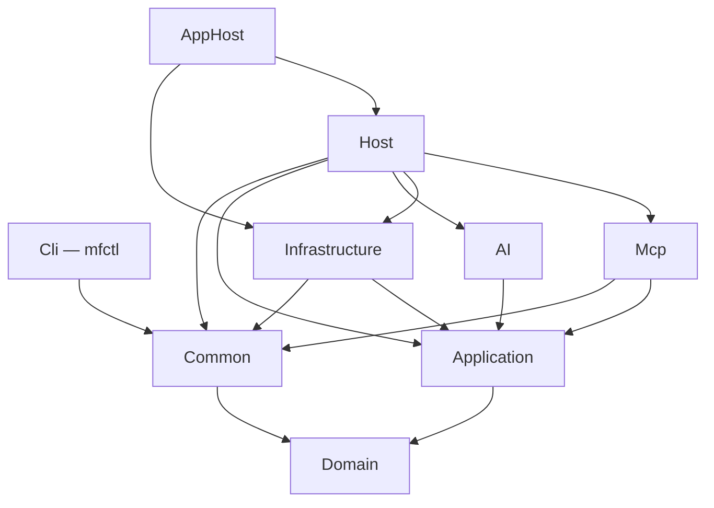

# Solution structure

<!-- describes: backend/MailFathom.slnx, backend/Directory.Build.props, Version.props, backend/src/*/*.csproj, backend/tests/*/*.csproj, backend/tools/*/*.csproj, frontend/MailFathom.Client.slnx, frontend/Directory.Build.props, frontend/*/*/*.csproj, frontend/*/README.md, backend/src/Host/ServiceDefaultsExtensions.cs -->

MailFathom uses a clean-architecture modular monolith. Dependencies point inward from adapters and hosts toward application and domain contracts.

The service's solution lives under `backend/`: `backend/src/` holds the projects below and `backend/tests/` the suites
that cover them. `frontend/` stands beside it with the same two directories and a solution of its own,
`frontend/MailFathom.Client.slnx`, holding the Uno Platform client. What decides which of the two a file belongs to is
the stack it is built by rather than what it is about — everything on this page except its last section describes
`backend/`.

The build contract moves down with the solution: `backend/MailFathom.slnx`, `backend/Directory.Build.props`, and
`backend/Directory.Packages.props` sit beside `backend/src/` and govern it and nothing else. MSBuild walks up from a
project file until it finds a `Directory.Build.props`, so a copy at the repository root would silently govern every
project in the repository — a second stack's heads included, under a single `net10.0` target, `TreatWarningsAsErrors`,
and an `AssemblyName` prefix written for these boundaries. `backend/tools/` sits under the same root for the same
reason: it is development tooling this solution references from its tests, and it ships nothing.

Three files stay at the repository root, because each one genuinely governs every stack. `global.json` pins the SDK —
and, in `msbuild-sdks`, the Uno SDK version every client package follows from — while `NuGet.config` decides which feeds
a package may come from, and neither is a decision a stack may take twice. `Version.props` carries `<VersionPrefix>` and
the two numeric assembly identities derived from it; each stack's own `Directory.Build.props` imports it, so a client
and a server that ship together report one version rather than two that can drift.

Every arrow is a project reference, and the diagram is the whole set: each project's references are exactly the ones
drawn from it, with the reference every project holds to `Domain` left implicit where a path already reaches it. The
sections below say what each project is for and why two of them are shaped against the ordering rather than by it.

## Runtime projects

- `Domain` contains pure business concepts and invariants.
- `Application` contains use-case contracts and ports and references only `Domain`.
- `Infrastructure` implements persistence, IMAP/SMTP, message-content storage, security, and observability adapters.
- `AI` owns chunking, embeddings, retrieval, and agent-framework composition.
- `Mcp` maps MCP protocol requests and responses to application use cases.
- `Host` is the ASP.NET Core composition root.
- `Cli` is the administration command, and it references `Common` alone. It reaches a deployment over HTTP through the
  administrative endpoint and holds no other capability, which is what lets it publish as a trimmed self-contained
  binary per platform: a reference to `Infrastructure` would put EF Core, Npgsql, and MailKit into an artifact that
  calls none of them, and would make trimming it impossible. Its assembly is named `mfctl` rather than after its
  boundary, because the published file is something an operator types repeatedly; the project, its directory, and its
  namespace stay `Cli`.
- `Common` is cross-cutting code that belongs to no boundary and depends on nothing but the base class library and
  `Domain`. It is not a layer and has no place in the dependency ordering above: `Cli`, `Mcp`, `Infrastructure`, and
  `Host` reach it, and it reaches only the innermost project, so that a failure it raises derives from
  `MailFathomException` like every other. Admission is narrow on purpose — code arrives when a second boundary genuinely
  needs it, and lives with its one consumer until then — because a project defined by what it is not becomes the drawer
  everything ends up in. Four things have earned it: the AES-GCM envelope, the mailbox OAuth exchange under
  `MailboxOAuth/`, the telemetry name under `Observability/`, with the one activity source and the one meter carrying
  it, which every subsystem that emits a signal publishes through and the host subscribes, so that no boundary chooses
  what it is called, and `DocumentationAddress`, which the administrative command and the protocol surface both answer
  from so that a reader of either is sent to the pages for the version actually in front of them.
- `AppHost` is the Aspire local-development orchestration host.

`Cli` also authorizes a mailbox, because one thing a headless service structurally cannot do is ask a person to sign
in, and a mailbox at a provider that has withdrawn password authentication needs exactly that once. Keeping it in the
operator's command is what lets the host serve no consent page, own no redirect endpoint, and hold no
authorization-server credential it has no run-time use for; [mailbox OAuth](../operations/mailbox-oauth.md) describes
the exchange it performs.

That exchange is the worked example of what `Common` is for. The command performs it and the run-time adapter refreshes
the grant it produced, so both speak to the same authorization server about the same account and have to agree on the
token response, the sanitizing of what that server returns, and the endpoints each provider publishes. Putting it in
`Infrastructure` would oblige the command to reference EF Core, Npgsql, and MailKit to reach it; duplicating it would
let the two halves of one conversation drift apart. `Cli` stays a composition root either way — it holds the commands
and their prompts, and no protocol of its own.

## What the published artifact carries

`Host` is the project that gets published, so it is also where the project's licensing travels with the binaries. Its publish output includes the repository-root `LICENSE` and `NOTICE` beside the assemblies, and a `VerifyPublishedLicenseAndNotice` target fails the publish when either is missing from the output directory. The check inspects the artifact rather than the source tree, because the failure worth preventing is an artifact that ships without its license — a missing source file would otherwise resolve to an empty item and publish quietly.

The identity in those files is declared once, in `backend/Directory.Build.props`: the product name, the author, the copyright, the repository URL, `PackageLicenseExpression`, and an `SPDX-License-Identifier` assembly metadata entry that puts the identifier into every assembly, since nothing here is packed as a NuGet package. Each source file repeats the grant, and names the repository the file came from, in the three-line header that `.editorconfig` defines and `IDE0073` enforces. The same three lines are carried by hand outside the solution, where that analyzer does not reach — the workflows, the shell scripts, the Helm chart, and the skills — and `scripts/test-agent-workflow.sh` compares each of them against the one template.

## Keeping compiled source inside its project

No project compiles source from outside its own directory. The Aspire service-defaults template scaffolds its extensions into a repository-root `shared/` directory and links them into each executable service with a `Compile Include="..\..\shared\..."` item, which pays for itself only when several services consume the same file. MailFathom has one such consumer, so the scaffold lives with it as `backend/src/Host/ServiceDefaultsExtensions.cs` in the `MailFathom.Host` namespace.

That linked-source arrangement also cost visibility, because the `CI` workflow decides in its `Detect changes` job whether the build and formatting jobs have anything to do, and both of its filters rest on `backend/src/**`, `backend/tests/**`, and `backend/tools/**`: a file outside those paths changed a production assembly without triggering the build, unit-test, coverage, or formatting gates. Keeping every compiled file under one of those three roots is what makes those filters trustworthy, and adding a fourth means adding it to both filters in the same change.

If a second executable service ever needs these defaults, the answer is a project that both reference, not a source file linked into each.

`backend/src/shared/` is the one deliberate exception in production code. `RequiresIntegrationCoverageAttribute.cs` is why it exists: the coverage collector recognizes the marker by attribute name, not by declaring assembly, so a shared project would buy nothing a shared file does not already give and would put a build-tooling reference into every boundary that marks a class — including `Domain`, whose reference set is the point of the architecture. `StampedAssemblyVersion.cs` sits beside it and reads the version attributes an SDK stamps into whichever assembly it is handed, which every consumer needs about itself. Both sit under `backend/src/**`, so the change filters that made the Aspire scaffold a problem still cover them, and the exception stays narrow: anything with executable logic that a caller reaches for as a capability gets a project, which is what `Common` is.

`backend/tests/shared/` is the same exception on the test side, and holds `RecordingLoggerProvider.cs` together with `FakeHttpMessageHandler.cs` and the `RecordedHttpRequest` snapshot it records into, and `StubMailFolderMappings.cs`, which answers which folder of an account a name refers to — a port every boundary that lets a folder be named now reads through, so a test about something else still has to supply one. A test that asserts what a component logged — and what it kept out of the log — needs the same recorder whichever boundary it exercises, and the same holds for the handler that answers an HTTP call without a network. Shared test *data* qualifies on the same reading, and `AdversarialMailCorpus.cs` is the case: the messages an answering run is attacked with are put to the retrieval boundary and to the request boundary, and two copies of them would let one boundary be proved against an attack the other had never seen. `LargeSyntheticMessage.cs` is the same case for a different reason — the allocation budgets state their bounds as a share of that message's length and the nightly benchmarks time the same paths over it, so a second copy would leave a budget and a measurement talking about different messages — and `NoTrustedAuthentication.cs` travels with it, because extracting that message without pushing it down the trusted-header path needs the same one-answer reader in both. A test-only helper project would be a build artifact whose only consumers are test projects that already compile source together, and it would carry a second cost here: its assembly name would not end in `.UnitTests`, so the coverage filters would pull test-only code into the measured denominator, and the exclusion needed to keep it out would be indistinguishable from one added to reach the threshold. Linking leaves every consumer's assembly already excluded. The files sit under `backend/tests/**`, so the change filters cover them, and the same limit applies: a helper is shared as source, anything with production behavior gets a project. Everything here uses the assembly-neutral `MailFathom.TestSupport` namespace.

## Development tooling

`backend/tools/` is a third directory beside `backend/src/` and `backend/tests/`, and it holds what a developer runs against a checkout rather than what MailFathom is. One project lives there. `SyntheticMail` invents mail and delivers a batch of it over SMTP to a development mailbox, which is how a mailbox gets filled without anybody's real correspondence entering a development database; [Local development](../operations/local-development.md#filling-a-development-mailbox) describes what it does and what it reads.

The directory exists because that project is neither of the other two things. It is not `backend/src/`: it ships in no artifact, it is not a command of `mfctl`, and the container image's build context is an allow-list that admits `backend/src/` and never sees it. It is not `backend/tests/` either, because it is a command a person types rather than something a runner executes. That is the whole of the reason: a project under `backend/tests/` is discovered by the coverage gate's own glob unless `.config/CodeCoverage.proj` names it as an exception, which `backend/tests/Benchmarks` is, so being outside the gate is no longer a reason to be outside `backend/tests/`.

Being outside `backend/src/` is what makes the exclusion true today — the release publishes `backend/src/Cli/Cli.csproj` by name — and `the_development_tooling_never_reaches_a_published_artifact` in `scripts/test-agent-workflow.sh` is what keeps it true: it refuses a project under `backend/src/` that references one under `backend/tools/`, a workflow step that names a path there, and a line re-admitting the directory to the image's build context. What it deliberately permits is the `paths-filter` entry in `ci.yml`, which decides which jobs a change starts and is the opposite of publishing.

Everything else applies unchanged. The project is in `backend/MailFathom.slnx`, so it is restored, built in Release, analyzed, and formatted by exactly the same gates as any other; it carries a committed lock file; and `SyntheticMail.UnitTests` covers it. Only the coverage *denominator* differs: `.config/CodeCoverage.proj` measures projects under `backend/src/`, so this one is outside it by construction, and `.config/testconfig.json` names its assembly in the collector's `Exclude` beside the two composition roots — an assembly the collector instrumented but no measured project builds is exactly what the gate's denominator check refuses.

`backend/tests/IntegrationTests` references it, and that reference is the point rather than a compromise: the generator is the one implementation of *build a synthetic message* in the repository, so the mail the suite proves things about is the mail a developer works against. The arrow points from the test suite into the tool and never the other way.

## Naming an adapter after its library

A type inside an adapter carries the library's name only when its own members traffic in that library's types. `MailKitImapConnection`, `MailKitRemoteFolderCatalog`, and `MailKitTransportSecurityMapping` take or return `IImapClient`, `IMailFolder`, and `SecureSocketOptions`, so their names are accurate. `ImapAccountSettings` and `IImapAccountSettingsProvider` describe a host, a port, and credentials in plain IMAP vocabulary and would survive replacing the client library unchanged, so they live directly under `Infrastructure/Mail/` and name no vendor. The test is mechanical: if swapping the library would not change a single member, the name must not say the library.

The adapter consumes MailKit's own `IImapClient` rather than a port restating it. An interface this repository declares has to earn its existence — a seam the library leaves open, behavior of its own, or a surface deliberately narrowed for a stated safety reason. A member-for-member copy of a published interface is none of those: it buys no replaceability, because every one of its members would change with the library anyway, and it goes stale the moment the library moves. Replaceability lives one layer up, at `IMailboxSession`, `IMailboxSessionFactory`, and `IRemoteFolderCatalog`, which traffic in domain types and keep mail-library types out of `Application`.

## Interfaces this repository declares

Every interface declared under `backend/src/` was checked against that rule once the MailKit copy was removed, and none of the survivors restates a published contract. Each one now names the reason it exists in its own documentation, so the next interface added is judged by the rule rather than by resembling the ones already here.

The ports in `Application` exist because the alternative is a library type in a use-case signature. `IMailboxSession`, `IMailboxSessionFactory`, and `IRemoteFolderCatalog` traffic in domain types and keep the mail library out; `IEmailMetadataRepository`, `IEmailContentStore`, `ISynchronizationCheckpointStore`, `IMailFolderResolutionStore`, `IPersistenceSession`, and `IPersistenceSessionFactory` do the same for EF Core, which publishes nothing at this altitude beyond a transaction handle and a concrete `DbContext`. Several also narrow deliberately: the mailbox session and the folder catalog expose no operation capable of setting `\Seen`, `IMailTransportSecurityPolicyReader` hands an adapter a validated policy it can only obey, `IMailFolderMappingChangeAuditor` is the only way to write a remote folder path outside the database, and `ITransientFailureClassifier` lets a supervisor ask the question the retry pipeline asks itself without depending on the resilience library that owns it.

The contracts declared in `Infrastructure` carry behavior no library offers. `ISecretReferenceResolver` and `ISecretSchemeResolver` are the extension point that keeps a managed secret store a registration rather than a refactor, and they are deliberately unreachable from `Application` so no use case gains the ability to ask for any secret by name. `IDatabaseConnectionSettingsValidator` asks what resolving a candidate's references does not answer — whether the setting that supplies the credential still has the shape the pool was composed around, and whether the resolved material parses into a connection string that carries a password when that secret is what must supply one — because material that resolves but does not parse would replace the last known good settings and fail every connection opened afterwards, and `IImapAccountSettingsProvider` resolves an account's secrets at the moment a connection is made so no settings object holds a live password between operations.

The rest sit close enough to a published type that the verdict is worth recording against it. `ISettingsSnapshot<TSettings>` is `IOptionsMonitor` reduced to one member and given a publication rule the framework has no equivalent for: a candidate becomes current only after every secret reference in it resolves. `IEfCorePersistenceSessionResources` covers what `IDbContextTransaction` does not — saving tracked changes, classifying a provider update failure as an optimistic conflict, clearing tracked state — and exists because the type holding the rest is a concrete class no fake provider may stand in for, while `IEfCorePersistenceSession` is the one-member seam that lets a write repository take its context from the caller's session instead of injecting its own. `ISecretFileReader` and `IEnvironmentVariableReader` wrap BCL statics that publish no interface at all, which is the plainest form of a seam the library leaves open. `IDatabaseSchemaInspector` exists so the composition root can refuse to start against a schema the build does not recognize without taking on EF Core itself: whether a pending migration is fatal is a host decision, and reading the migration history is a persistence one. It reads and never writes, because applying a migration is a reviewable deployment step rather than something an adapter may decide to do.

## Test projects

Unit tests live under `backend/tests/` and are split by production boundary. They use xUnit.net v3 on Microsoft Testing Platform v2 and NSubstitute for architectural-boundary doubles.

Three of them — `Application.UnitTests`, `AI.UnitTests`, and `SharedSources.UnitTests` — also reference CsCheck, which generates the inputs a property test states its invariant over: the shared keyset cursor codec, the chunking boundaries, the daily recurrence around a clock change, and the redaction guarantee. It is a generator rather than a second test framework, so a property is an ordinary `[Fact]` and nothing about discovery, running, or reporting changes, and it carries no dependency of its own. Each property test class builds its generators against the `Gen` API directly, and samples them through `PropertyCheck` in `backend/tests/shared`, which is what fixes the thread count and the reproduction contract in one place rather than per suite. `backend/tests/AGENTS.md` § *Properties and examples* holds when a property is written and when an example still is.

One project is named after a shared directory rather than a boundary, because the linked-source directories otherwise have no project that owns their contract: `SharedSources.UnitTests` compiles both `backend/src/shared/` and `backend/tests/shared/` the same way a consumer does. It carries the longer name because CA1716 rejects `Shared` as a namespace, which is a reserved word in another .NET language.

`Boundaries.UnitTests` is named after no boundary at all, because what it covers is what holds *between* them. Its rules read the compiled intermediate language of every assembly a release ships, through ArchUnitNET, and that is the whole reason it exists beside the reference-list assertions the boundary suites already carry: reflection reports what a signature names, so a capability obtained inside a method body and never stored is invisible to it, and a library confined to one namespace of an assembly is a claim a reference list cannot make at all. It reaches every assembly through `Host` and `Cli`, the two executables, and asserts three things — that nothing outside `Application` and `Infrastructure` can obtain a mailbox write session, that Entity Framework Core, Npgsql, pgvector, and the entities they map stay inside the persistence adapter, and that MailKit and MimeKit stay inside the mail adapter. Two exceptions are named in the rules themselves rather than worked around: `ServiceCollectionExtensions` composes every adapter and therefore names every library one is built on, and `TransientFailureClassifier` reads MailKit's exceptions to answer whether a protocol failure is worth retrying.

`PublicSurfaces.UnitTests` is named after no boundary either, and for a related reason: its subject is two of the four public surfaces [ADR 0004](https://github.com/Krzysztof318/MailFathom/blob/main/docs/decisions/0004-versioning-and-release-policy.md) governs, each of which is composed by a different project. It renders every registered MCP tool descriptor and every bindable configuration key into a golden file committed beside its sources, and holds the next build's rendering against it. The point is not to judge a change — a break on either surface is permitted below `1.0.0` — but to make one impossible to take unnoticed, so the changelog entry a release depends on stops resting on the author's memory. It references `Host` and `Mcp` so a renamed options class or a renamed tool breaks the build here instead of quietly emptying a record, and it reaches the bound options classes through an `InternalsVisibleTo` grant, since every configuration section binds into an internal type. The two surfaces it does not cover are covered elsewhere: the database schema by `OrchestratedSchemaArtifactTests` against a real server, and the deployment contract by the assets that render it.

`SyntheticMail.UnitTests` is named after a boundary that is not a production one, because the project it covers is under `backend/tools/` rather than `backend/src/`. Its assertions are as binding as any other suite's — a generator that stopped producing the same corpus from the same seed would be useless and would say nothing about it — and only the coverage denominator treats it differently, for the reason [Development tooling](#development-tooling) gives.

`AllocationBudgets.UnitTests` is named after a claim rather than a boundary, because the claim spans three of them. It bounds what MIME extraction, an attachment download, a content-store read, and chunking allocate while processing one large synthetic message, and each bound is a named constant carrying the reasoning for its value. Splitting those four across `Infrastructure.UnitTests`, `Application.UnitTests`, and `AI.UnitTests` would put each budget where its subject lives and the reasoning behind all four nowhere. Two properties are the project's own rather than the repository's default: it disables test parallelization, because the measurement reads what the whole process allocated and a second test allocating beside it would be counted; and it holds no timing assertion at all, for the reason `backend/tests/AGENTS.md` states.

`Benchmarks` is the one project under `backend/tests/` that is not a suite. It measures how long chunking, ranking, and MIME extraction take with BenchmarkDotNet and runs from `nightly.yml` as a report that gates nothing — no job waits on it and a failure there is swallowed — because throughput on a shared, virtualized runner is not reproducible to a precision any threshold could read. It sits here rather than under `backend/tools/` because what it measures is the other half of what `AllocationBudgets.UnitTests` measures and the two share the message they measure, and because a benchmark is something a runner executes rather than a command a person types. `.config/CodeCoverage.proj` names it as the exception to the glob that finds test projects, and `.config/testconfig.json` excludes its assembly the way `SyntheticMail`'s is excluded.

The coverage marker is asserted against a sample type declared beside its tests, carrying the marker on the type, a property, and a method. Pointing the assertion at a boundary that happens to apply the marker today would tie the marker's own contract to that boundary's contents, and it would also walk into the trap this arrangement sets: every consumer compiles its own copy of the marker from `backend/src/shared`, so a copy compiled in one assembly and a copy applied in another are distinct types to the runtime, and `IsDefined(typeof(RequiresIntegrationCoverageAttribute))` across that boundary matches nothing while the assertion still passes. A local sample keeps the types identical, and the test reads the marker by name anyway, which is how the coverage collector recognizes it.

`FakeHttpMessageHandler` is the suite's only HTTP double, and it is hand-written because NSubstitute cannot produce one: `HttpMessageHandler.SendAsync` is protected, so no substitute can override it, and adding a third-party HTTP mocking package would introduce a second test-double mechanism without removing that constraint. It records each request as an immutable snapshot taken at send time, because the caller keeps ownership of the request message and may dispose, mutate, or reuse it before an assertion reads it, and answers either from a factory that builds a fresh response per request or from a script consumed one response per request. Two details exist to keep the double from behaving unlike a real transport: responses carry the request that produced them, which `HttpClient` populates only for its own stack, and concurrent requests are recorded in the order they reached the handler rather than in the order their bodies finished being read.

`Host.UnitTests` and `AppHost.UnitTests` are the projects whose subjects are excluded from the coverage denominator, and the two composition roots are the whole of what the gate does not measure. `Host` stays excluded because a composition root's wiring would dilute the measurement of the boundaries that hold the logic, but exclusion from a metric is not exemption from testing: options validation rules, startup fail-fast behavior, and the worker's per-folder failure isolation are decisions the host owns and they are asserted like any other. Anything larger belongs in `Application` or `Infrastructure`, where it counts.

## The client stack

`frontend/` holds two source projects and one test project, and `frontend/MailFathom.Client.slnx` is what builds them.
`frontend/Directory.Build.props` and `frontend/Directory.Packages.props` are its own; the backend solution names no
project here and neither build reads the other's files.

- `src/Client` is an Uno Platform single project. One project carries every head the application runs as, chosen by
  target framework: `net10.0-desktop` is the Skia desktop head that runs on Windows, Linux, and macOS, and
  `net10.0-browserwasm` is the browser head. Its assembly is `MailFathom.Client`.
- A third target framework, plain `net10.0`, builds no head. It exists so a unit-test project can reference the
  application, since a test host is neither a browser nor a window.
- `src/Client.Backend` is everything that reaches the service: the typed client, the wire records and their
  source-generated readers, and the OAuth sign-in. It targets that plain `net10.0` alone and references no Uno package,
  which is the point of it — the boundary between a view and a service call is a reference graph here rather than a
  convention, so a WinUI type written in it does not compile. `Client` references it and it references nothing here.
- The one step of signing in that a head cannot share is a port, `ISignInRedirectListener`. The loopback implementation
  the desktop head uses ships in `Client.Backend`; the browser head's lives under `src/Client/Platforms/WebAssembly/`,
  because it needs the JavaScript interop only that target framework compiles — and that interop is why the browser
  head is the one place the application project sets `AllowUnsafeBlocks`, which the `[JSImport]` generator requires.
- `src/Client/Notices/` is what a published desktop head has to carry beside it: the LGPL-2.1 text and the notice
  naming the one component in that head's graph whose licence obliges them. The project file attaches them to every
  `net10.0-desktop` publish and fails the build when one is missing, so the obligation travels with the artifact rather
  than with the workflow that happens to produce it.
- `tests/Client.UnitTests` covers both, referencing the application through its plain target and `Client.Backend`
  directly, on the same xUnit.net v3 and Microsoft Testing Platform the service's suites use.
- Almost no client package version is written in this repository. `UnoFeatures` in the project file names capabilities
  rather than packages, and the Uno SDK resolves each to a package at the version its own pin decides, so a restore is
  where those versions become readable. `Client.Backend` is the exception and pins one package by hand,
  `Microsoft.Extensions.Http`, because a plain library resolves the typed-client registration as an ordinary package
  rather than from a shared framework. Both it and the unit-test project record their closure in a committed
  `packages.lock.json`; the application project carries none, because a WebAssembly target restores three packages the
  .NET SDK versions from itself and `global.json` lets the SDK roll forward. `frontend/Directory.Build.props` names
  them and says what a lock file there would have recorded instead.

The client reaches MailFathom over the endpoints `Host` exposes and shares no type with it — its wire records and its
OAuth code are its own, stated again at this end rather than referenced across the boundary. Which deployment it
reaches is the composing head's to supply, through `IDeploymentAddressSource`: an installed head reads the `Deployment`
section out of an embedded `appsettings.json`, and the browser head reads the origin it was served from, because the
container image serves the bundle from the same origin as the surface it calls. `frontend/src/AGENTS.md` states what
governs a change there, and `frontend/tests/AGENTS.md` what governs one in its suite.

That image is the one place the two stacks meet in a build, and it is a file copy rather than a reference. A stage of
`deploy/docker/Dockerfile` publishes the browser head and copies its output into the runtime image's `wwwroot`; no
project in either solution names one in the other, and `HostDependencyBoundaryTests` asserts the service assembly's
reference list so that stays true. Serving those files is off unless a deployment turns it on —
[the client endpoint](../operations/client-endpoint.md#serving-the-client-from-the-deployment) is the page.
